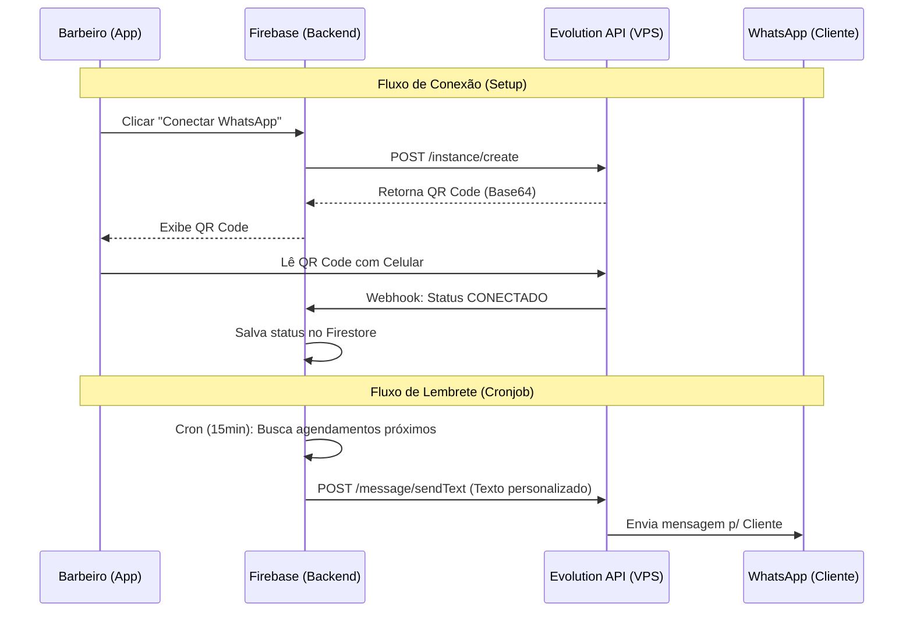

# Arquitetura e Guia de Implementação: Notificações WhatsApp via Evolution API

> **Objetivo:** Implementar sistema de lembretes automáticos enviados pelo **próprio número do barbeiro**, sem custo por mensagem (custo zero marginal) e utilizando infraestrutura própria.

## 1. Visão Geral da Arquitetura

Para evitar os custos elevados da API Oficial do WhatsApp (Meta) e limitações de gateways terceiros, utilizaremos a **Evolution API** hospedada em um servidor VPS próprio.

Esta arquitetura funciona como um "WhatsApp Web Automatizado":
1.  O sistema cria uma instância na API para cada barbearia.
2.  O barbeiro lê um QR Code na tela de configurações.
3.  O servidor mantém a sessão ativa e dispara mensagens programadas.

### Diagrama de Fluxo



---

## 2. Requisitos de Infraestrutura (VPS)

Você precisará de um servidor rodando Docker.

*   **Servidor Recomendado:**
    *   **Opção Grátis:** Oracle Cloud Free Tier (ARM Ampere).
    *   **Opção Paga:** Hetzner, DigitalOcean ou Vultr (~$5/mês).
    *   **Specs Mínimas:** 2 vCPU, 2GB RAM (suporta ~50-100 clientes conectados).

*   **Software Necessário:**
    *   Docker + Docker Compose
    *   Nginx (como Reverse Proxy com SSL)
    *   Evolution API v2 (Imagem Docker oficial)
    *   Redis (banco de dados da API)

### Exemplo de `docker-compose.yml` para a VPS

```yaml
version: '3.3'
services:
  evolution_api:
    image: attrium/evolution-api:v2.1.1
    restart: always
    ports:
      - "8080:8080"
    environment:
      - AUTHENTICATION_API_KEY=SUA_CHAVE_SUPER_SECRETA
      - SERVER_URL=https://whatsapp.obarberia.online
      - CONFIG_SESSION_PHONE_CLIENT=BarberIA
      - DATABASE_ENABLED=true
      - DATABASE_CONNECTION_URI=mongodb://... (ou use SQLite local para testes)
      - REDIS_ENABLED=true
      - REDIS_URI=redis://redis:6379/0
    depends_on:
      - redis

  redis:
    image: redis:alpine
    restart: always
```

---

## 3. Plano de Implementação (Passo a Passo)

### Fase 1: Backend (Firebase Functions)

Criar arquivo `functions/src/api/whatsapp.ts`.

1.  **`createInstance(userId)`**
    *   Chama `POST /instance/create` na sua VPS.
    *   Configura Webhook para receber updates de status.
    *   Retorna os dados da instância + QR Code (se disponível).

2.  **`getConnectionStatus(userId)`**
    *   Chama `GET /instance/connectionState/{userId}`.

3.  **`disconnectInstance(userId)`**
    *   Chama `DELETE /instance/logout/{userId}`.

Criar arquivo `functions/src/jobs/notifications.ts`.

4.  **`sendRemindersWorker` (Cloud Scheduler)**
    *   Roda a cada 15 min.
    *   Query Firestore: Agendamentos `confirmed`, `hoje`, `sem lembrete`, `horário - 30min`.
    *   Para cada agendamento:
        *   Verifica se o barbeiro tem instância conectada.
        *   Formata mensagem (ex: *"Olá {cliente}, seu horário é às {hora}. Confirmado?"*).
        *   Chama `POST /message/sendText`.
        *   Marca `reminderSent: true` no Firestore.

### Fase 2: Frontend (React)

Criar componente `src/features/settings/components/WhatsappConnect.tsx`.

1.  **Interface de Conexão:**
    *   Botão "Conectar WhatsApp".
    *   Exibir Spinner enquanto busca QR Code.
    *   Renderizar QR Code (imagem base64).
    *   Polling ou Listener para detectar quando conectar (mudança de status).

2.  **Configuração de Mensagem:**
    *   Input para o barbeiro personalizar o texto do lembrete.
    *   Variáveis disponíveis: `{cliente}`, `{horario}`, `{servico}`, `{barbearia}`.

---

## 4. Custos e Escalabilidade

*   **Custo por Mensagem:** R$ 0,00.
*   **Custo de Infra:** Fixo (valor do VPS).
*   **Limites:**
    *   Evitar envio em massa (spam) para não bloquear o número.
    *   Lembretes transacionais são seguros.
    *   Se o celular do barbeiro desconectar (sem bateria/internet), as mensagens falham.

## 5. Próximos Passos Imediatos

1.  Contratar/Configurar a VPS.
2.  Apontar subdomínio `whatsapp.obarberia.online` para a VPS.
3.  Instalar Evolution API.
4.  Copiar a `API Key` da VPS para as *Secrets* do Firebase (`firebase functions:secrets:set EVOLUTION_API_KEY`).
